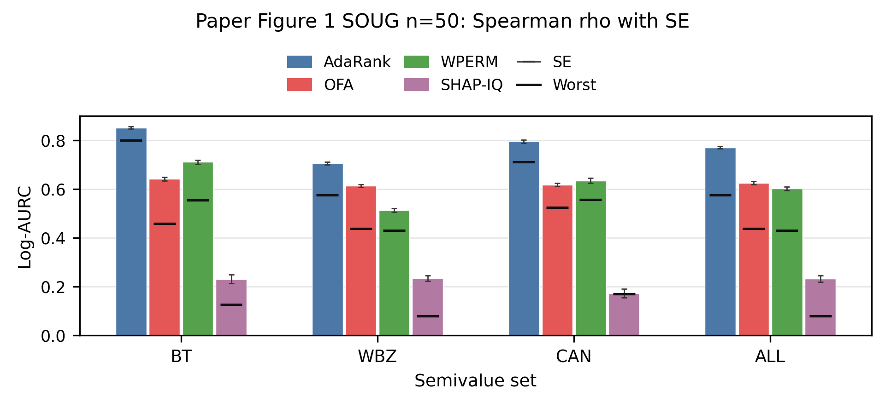

# Shared Multi-Semivalue Ranking

Code for *Multi-Semivalue Ranking via Shared Utility Evaluation*.

## Installation

Use Python 3.10 or newer.

```bash
python -m venv .venv
source .venv/bin/activate
python -m pip install -r requirements.txt
```

Tested with Python 3.13.12, NumPy 2.4.5, pandas 3.0.3, SciPy 1.17.1, scikit-learn 1.8.0, and Matplotlib 3.10.9.

## Quick Check

The default config runs AdaRank once on the bundled SOUG dataset. The nine semivalues share one sampling pass.

```bash
python scripts/run_sampling.py --no-save
```

Run every implemented method with:

```bash
bash scripts/run_smoke.sh
```

## Bundled Datasets

| Dataset | Players | Validation | Utility | Reference |
| --- | ---: | ---: | --- | --- |
| SOUG | 50 | — | SOUG utility | Closed form |
| Breast Cancer | 50 | 99 | SVM validation accuracy | WPERM, 3 × 100,000 permutations |
| Wine | 50 | 50 | SVM validation accuracy | WPERM, 3 × 100,000 permutations |

The fixed Breast Cancer and Wine player and validation files are under `data/breast_cancer_n50/` and `data/wine_n50/`. Each reference archive contains score vectors defining the rankings for all nine target semivalues and the three independent WPERM batch estimates. `reference_quality.csv` contains the independent-replica checks.

The original files under `data/original/` are from the UCI Machine Learning Repository:

- William Wolberg, [Breast Cancer Wisconsin (Original)](https://doi.org/10.24432/C5HP4Z).
- Stefan Aeberhard and M. Forina, [Wine](https://doi.org/10.24432/C5PC7J).

Both datasets are distributed by UCI under CC BY 4.0.

## One Sampling Pass

Edit `configs/sampling.json`, then run:

```bash
python scripts/run_sampling.py
```

The config fields are:

| Field | Value |
| --- | --- |
| `run_name` | Output directory prefix |
| `dataset` | `soug`, `breast_cancer`, or `wine` |
| `method` | `IncRank`, `ExcRank`, `StdRank`, `AdaRank`, `OFA`, `OFA-S`, `GELS`, `WPERM`, `WSL`, `WSHAP`, or `SHAPIQ` |
| `semivalues` | Target semivalue list |
| `uep` | Utility evaluations per player |
| `seed` | Sampling seed |
| `size_distribution` | Coalition-size distribution for flexible methods |
| `size_distribution_alpha` | Exponent used by the `poly` distribution |
| `boundary_mode` | `exact` or `none` |
| `output_root` | Result directory |

For shared methods, the total budget is `50 * uep`, and one set of sampled statistics is reweighted for every selected semivalue. Exact boundary mode charges the singleton and leave-one-out cost against this budget. Timestamped outputs contain `manifest.json`, `metrics.csv`, and `scores.npz`.

Flexible shared methods accept `uniform`, `poly`, `ofaa`, and `ofaset` size distributions. For `poly`, coalition size (s) has weight proportional to `[s(50-s)]^size_distribution_alpha`. The default distribution is `ofaa`.

`OFA-S`, `GELS`, and `WSL` require exactly one selected semivalue. A fixed-cost method returns `not_applicable` when one sampled object does not fit the budget.

## Figure-1-Style Panels

SOUG `n=50` Figure 1 panel:



Generate a separate panel and source tables for each dataset:

```bash
python scripts/generate_figure.py --dataset soug
python scripts/generate_figure.py --dataset breast_cancer
python scripts/generate_figure.py --dataset wine
```

The default uses five sampling runs over `uep = 10, 20, 30, 40, 50`. Use `--runs 1` for a faster check, `--budgets` for a comma-separated budget list, and `--output-dir` for another destination. Each command writes a timestamped 1920 × 900 PNG, a family summary CSV, and a raw metric CSV under `figures/`.

The panel uses AdaRank, OFA, WPERM, and SHAP-IQ. Bars show average Spearman-rho Log-AURC for BT, WBZ, canonical, and all-nine target sets. Gray caps show standard error, and black ticks show the worst target. Generated panels are single-instance checks, not aggregate paper reproductions.

## Dataset Generation

Generate or verify the bundled datasets with:

```bash
python scripts/generate_datasets.py --dataset all
```

Generate into another directory with:

```bash
python scripts/generate_datasets.py --dataset all --output-root /tmp/multi_semi_data
```

Available dataset values are `soug`, `breast_cancer`, `wine`, and `all`. Existing differing files are not overwritten unless `--overwrite` is supplied.

## WPERM References

Check the reference-generation path with two small independent batches:

```bash
python scripts/generate_wperm_reference.py --dataset breast_cancer --preset smoke
python scripts/generate_wperm_reference.py --dataset wine --preset smoke
```

The smoke preset checks execution only and is not expected to pass the reference quality thresholds.

Run the full reference setting with:

```bash
python scripts/generate_wperm_reference.py --dataset breast_cancer --preset paper
python scripts/generate_wperm_reference.py --dataset wine --preset paper
```

**Note:** Full reference generation is very time-consuming. For each dataset, the paper preset runs three independent batches of 100,000 permutations, with 5,000,000 utility evaluations per batch and 15,000,000 in total. Batch statistics are resumable. Run the smoke preset first.

Outputs include `reference_scores.npz` with scores and induced rankings, `quality_pairwise.csv`, `quality_summary.csv`, and `manifest.json`. A reference passes when every semivalue has minimum pairwise Spearman correlation at least `0.90` and Kendall correlation at least `0.75`. Use `--permutations`, `--batches`, `--workers`, and `--output-root` to override the preset.
